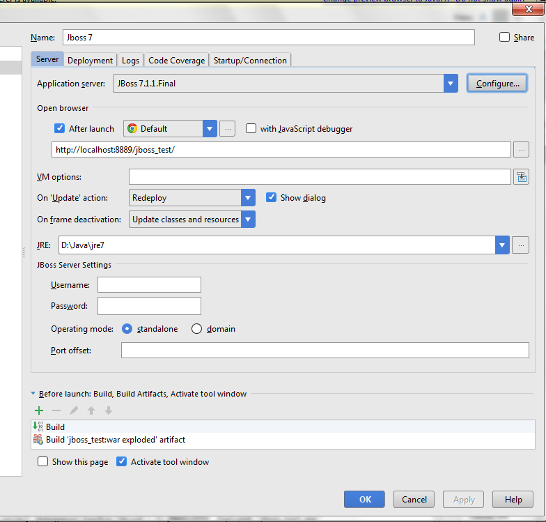

** JBOSS+IDEA配置注意事项**
    本项目采用了MAVEN.但是在实际的BUILD中无没有真的去与JBoss去关联起来
    需要注意的是，JBoss的端口修改位置
    `安装目录\standalone\configuration\standalone.xml`
    里面有修改HTTP请求端口
    
2.关于JBoss热部署
有两个关键点
`1，是在需要选择Artifacts里选择xxx:war exploded`
2.在选择启动时里选择

在上面的图片中可以看到这样的
on 'Update' 时选项中 选择Redeploy
 这样当使用快捷键SHIFT+F10
 可以重新部署
 3.JBoss 中的jsp的热布署
需要在
jboss-as-7.1.1.Final\standalone\configuration\standalone.xml中的
````
 <subsystem xmlns="urn:jboss:domain:web:1.1" default-virtual-server="default-host" native="false">
            <configuration> 
                <jsp-configuration development="true"/> 
            </configuration> 
			<connector name="http" protocol="HTTP/1.1" scheme="http" socket-binding="http"/>
            <virtual-server name="default-host" enable-welcome-root="true">
                <alias name="localhost"/>
                <alias name="example.com"/>
            </virtual-server>
  </subsystem>
  ````
  但是呢，在添加之后
  并没有起效果
  这个好像就是JBOss 7.1.1的bug
  解决的方式如下：
  
  在
  ```
  jboss-as-7.1.1.Final/modules/org/jboss/as/web/main
  ```
 这个文件 放在上面的目录下,并在同一目录下的moudle.xml文件中
  <!--<resource-root path="jboss-as-web-7.1.1.Final.jar"/> -->
 <resource-root path="jboss-as-web-7.1.1.Final-RECOMPILE.jar"/>
 然后重启即可解决jsp不能热布署的问题 
 jboss-as-web-7.1.1.Final-RECOMPILE.jar 
  