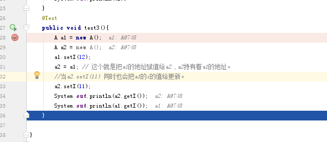

这里说一下变量的引用与地址的问题
如下： 

public class TestRefClass {
     @Test
     public void test1(){
         String t1 = new String();
         String t1 = "";  
         String t2 = new String("t2 string");
 
         t1 = t2;
         t2 = " t2 string again ";
         System.out.println(t1);//print t2 string
         
     }
 }
 
 

   @Test
   public void test3(){
         A a1 = new A();
         A a2 = new A();
         a1.setI(12);
         a2 = a1; // 这个就是把a1的地址赋值给a2 ,a2持有着a1的地址。
         //当a2.setI(11) 同时也会把a1的i的值给更新。
         a2.setI(11);
         System.out.println(a2.getI());
         System.out.println(a1.getI());
     }
     
 
 